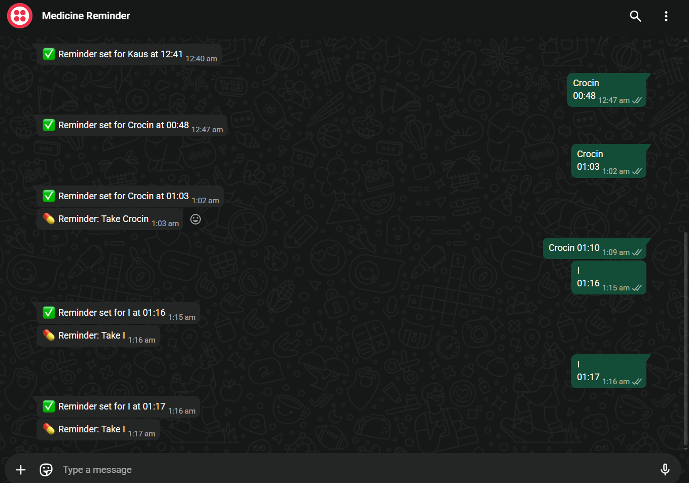

# 💊 WhatsApp Medicine Reminder Bot

## 🚀 Overview

A Python-based automation system that allows users to set daily medicine reminders via WhatsApp using Twilio API.

---

## 🎯 Problem Statement

People often forget to take medicines on time. This project solves that problem by sending automated WhatsApp reminders using a simple message interface.

---

## 💡 Solution

Users send a message in the format:

Crocin 14:30

The system:

* Parses the message
* Schedules a reminder
* Sends daily WhatsApp notifications

---

## 🧠 Features

* 📲 WhatsApp-based interaction (no app required)
* ⏰ Automated daily reminders
* 🔁 Real-time webhook integration using Flask
* 🧵 Background scheduler using Python
* 🔒 Secure credential handling using environment variables
* 📸 Visual demo included

---

## 🏗 Tech Stack

* Python
* Flask
* Twilio API (WhatsApp Sandbox)
* Ngrok
* Schedule library

---

## ⚙️ How It Works

1. User sends message:
   Crocin 22:00

2. Twilio webhook triggers Flask server

3. System parses medicine + time

4. Scheduler triggers daily reminder

5. WhatsApp message is sent automatically

---

## 📸 Demo

---

## 📂 Project Structure

Medicine_Reminder_Project/
│
├── app.py
├── requirements.txt
├── README.md
├── .gitignore
│
├── screenshots/
│   └── demo.png

---

## ⚙️ Setup Instructions

1. Clone repository

2. Install dependencies:
   pip install -r requirements.txt

3. Create `.env` file:
   TWILIO_ACCOUNT_SID=your_sid
   TWILIO_AUTH_TOKEN=your_token
   TWILIO_WHATSAPP_NUMBER=whatsapp:+14155238886
   YOUR_PHONE=whatsapp:+91XXXXXXXXXX

4. Run app:
   python app.py

5. Start ngrok:
   ngrok http 5000

6. Paste webhook in Twilio:
   https://your-ngrok-url/whatsapp

---

## ⚠️ Limitations

* Uses Twilio Sandbox (requires join code)
* Works locally (ngrok required)
* Single-user version

---

## 🔐 Security

* Credentials stored in `.env`
* `.env` excluded using `.gitignore`
* No sensitive data exposed

---

## 🚀 Future Improvements

* Multi-user support
* Database integration
* Prescription image upload (OCR)
* Cloud deployment
* Web dashboard

---

## 👨‍💻 Author

Kaustubh Dubey
